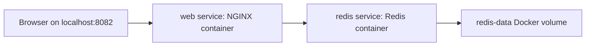

# Docker Lab

## Purpose

> Branch protection is enabled for `main`, requiring PR validation before merge.
This lab teaches the Docker foundations Kevin needs before moving deeper into Kubernetes, CI/CD, and platform engineering. It demonstrates how to build a custom image, run containers, manage configuration, use Docker Compose, connect multiple services, and persist state with volumes.

## Architecture



Current services:

- `web`: built from the local `Dockerfile`, tagged as `kevin-docker-lab:v5` using a pinned `nginx:1.31-alpine` base image, published on `localhost:8082`.
- `redis`: runs `redis:7-alpine`, available only inside the Compose network on port `6379`.
- `redis-data`: named Docker volume mounted at `/data` inside Redis for persistence.

## Files

- `Dockerfile`: builds a custom NGINX image and copies `index.html` into the web root.
- `index.html`: static page served by NGINX.
- `compose.yaml`: declarative runtime definition for the web and Redis services.
- `README.md`: lab runbook and learning notes.

## Common Commands

Build and start the stack:

```powershell
docker compose up -d --build
```

Check running services:

```powershell
docker compose ps
```

View logs:

```powershell
docker compose logs web
docker compose logs redis --tail=20
```

Run a Redis health check:

```powershell
docker compose exec redis redis-cli ping
```

Inspect environment variables in the web container:

```powershell
docker compose exec web env
```

## Persistence Test

Write a key to Redis:

```powershell
docker compose exec redis redis-cli set student Kevin
docker compose exec redis redis-cli get student
```

Recreate only the Redis container:

```powershell
docker compose rm -sf redis
docker compose up -d redis
docker compose exec redis redis-cli get student
```

Expected result:

```text
"Kevin"
```

This proves the data lives in the `redis-data` volume instead of only inside the Redis container writable layer.


## Production Hardening Notes

This lab now includes several production-minded Docker practices:

- The Dockerfile pins the base image to `nginx:1.31-alpine` instead of using `latest`.
- `.dockerignore` reduces build context size and helps keep local-only or sensitive files out of image builds.
- OCI labels add basic image metadata for traceability.
- Compose healthchecks report whether `web` and `redis` are responding.
- Redis uses a named volume so persistence files survive container recreation. Redis keys are still subject to Redis persistence behavior, such as when RDB snapshots are written.

These changes improve repeatability, observability, and operational safety without adding unnecessary complexity.

## Resource Limits

The Compose file sets basic resource controls:

```yaml
mem_limit: 128m
cpus: "0.50"
```

for the web service, and:

```yaml
mem_limit: 256m
cpus: "0.50"
```

for Redis.

These limits reduce blast radius by preventing a small lab service from consuming unlimited Docker Desktop resources. In production, limits should be based on measured usage, load testing, and alert thresholds. Limits that are too low can cause throttling or out-of-memory restarts.

To verify active limits:

```powershell
docker inspect docker-lab-web-1 --format "web Memory={{.HostConfig.Memory}} NanoCpus={{.HostConfig.NanoCpus}}"
docker inspect docker-lab-redis-1 --format "redis Memory={{.HostConfig.Memory}} NanoCpus={{.HostConfig.NanoCpus}}"
```
## Troubleshooting

If the browser cannot reach `localhost:8082`, check whether the host port is published:

```powershell
docker compose ps
```

Expected port mapping:

```text
0.0.0.0:8082->80/tcp
```

If the Compose config is correct but the container lacks the port mapping, recreate the stack:

```powershell
docker compose down
docker compose up -d
```

If Redis is not responding, check service state and logs:

```powershell
docker compose ps
docker compose logs redis --tail=50
docker compose exec redis redis-cli ping
```

## Rollback

To roll the web service back to an earlier image tag, update `compose.yaml`:

```yaml
services:
  web:
    image: kevin-docker-lab:v1
```

Then recreate the service:

```powershell
docker compose up -d web
```

Rollback principle: keep versioned image tags so a known-good artifact can be restored quickly.

## Cleanup

Stop and remove Compose-managed containers and the network:

```powershell
docker compose down
```

Remove the Redis data volume only when the stored Redis data is no longer needed:

```powershell
docker volume rm docker-lab_redis-data
```

Safety rule: do not remove unrelated volumes such as `jenkins_data`, `minikube`, or other existing resources unless their ownership and impact are understood.

## What Kevin Learned

- Images are immutable build artifacts.
- Containers are runtime instances of images.
- Port mappings expose selected container ports to the host.
- Logs are runtime evidence and should be checked after changes.
- Environment variables externalize non-secret runtime configuration.
- Docker Compose turns manual commands into declarative service configuration.
- Compose service names provide internal DNS, such as `redis`.
- Named volumes preserve state across container recreation.
- Production thinking means verifying actual runtime state, not only desired config.

## DevOps Principles

- Build once and promote versioned artifacts.
- Prefer declarative configuration over manual runtime changes.
- Expose only the ports that must be externally reachable.
- Keep persistent state outside replaceable containers.
- Verify changes through platform state, logs, and user-facing behavior.
- Keep rollback paths simple, tested, and documented.

## Security Hardening

The web service uses several container hardening controls:

```yaml
read_only: true
tmpfs:
  - /tmp
cap_drop:
  - ALL
security_opt:
  - no-new-privileges:true
```

These controls mean:

- `read_only: true` makes the container root filesystem read-only.
- `tmpfs: /tmp` gives NGINX a temporary writable runtime path for PID and temp files.
- `cap_drop: ALL` removes Linux capabilities the service does not need.
- `no-new-privileges:true` prevents processes from gaining extra privileges.
- The web container runs as the non-root `nginx` user from the unprivileged NGINX image.
- The web container listens internally on port `8080` instead of privileged port `80`.

Verification commands:

```powershell
docker compose ps
docker inspect docker-lab-web-1 --format "{{.HostConfig.ReadonlyRootfs}} {{.HostConfig.SecurityOpt}} {{.HostConfig.CapDrop}}"
docker compose exec web whoami
docker compose exec web id
docker compose exec web sh -c "cat /proc/1/status | grep Cap"
docker compose exec web sh -c "echo test > /usr/share/nginx/html/should-fail.txt"
docker compose exec web sh -c "echo test > /tmp/should-work.txt && cat /tmp/should-work.txt"
```

Expected evidence:

```text
web service is healthy
true [no-new-privileges:true] [ALL]
nginx
uid=101(nginx) gid=101(nginx) groups=101(nginx)
CapBnd: 0000000000000000
Read-only file system
test
```

Production principle:

Start with the least privilege possible and add back only what the application proves it needs.

## Image Vulnerability Scan

Docker Scout scan commands:

```powershell
docker scout quickview kevin-docker-lab:v5
docker scout cves kevin-docker-lab:v5
docker scout recommendations kevin-docker-lab:v5
```

Current scan summary:

```text
Critical: 0
High: 2
Medium: 9
Low: 0
```

Observed affected packages included:

- `curl`
- `libxml2`
- `busybox`

Docker Scout reported:

```text
Fixed version: not fixed
This image version is up to date.
There are no tag recommendations at this time.
```

Current decision:

This is acceptable for the local lab because the image is not production-facing, the service is static, and runtime hardening is enabled. In production, this would require a tracked risk exception, owner, expiry date, and periodic rescans.

Follow-up actions:

- Re-scan after base image updates.
- Prefer removing unused vulnerable packages when possible.
- Review whether vulnerable packages are reachable by the application.
- Do not ignore high vulnerabilities in production without documented approval.
